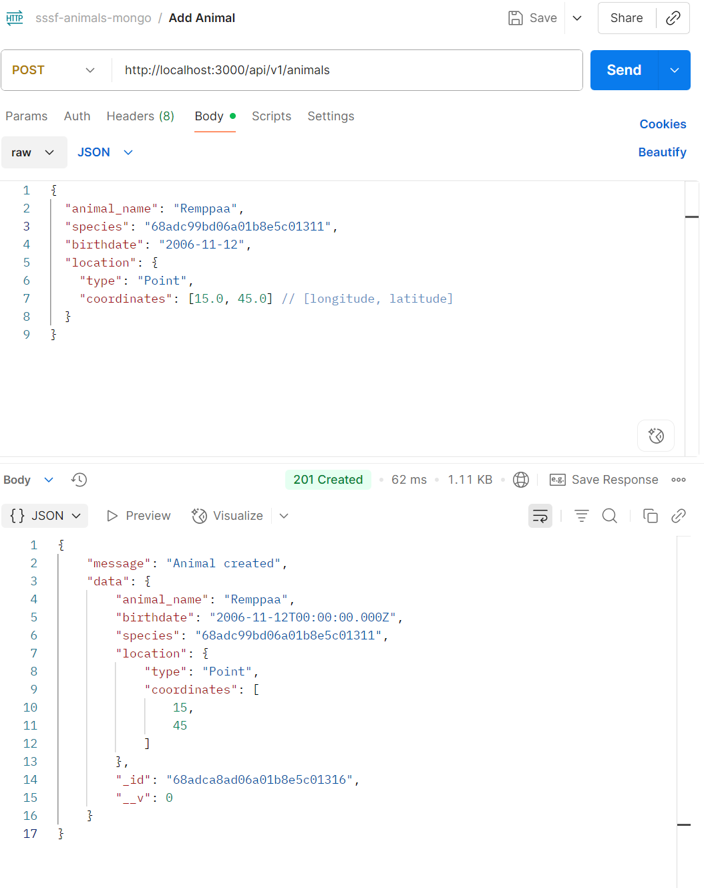
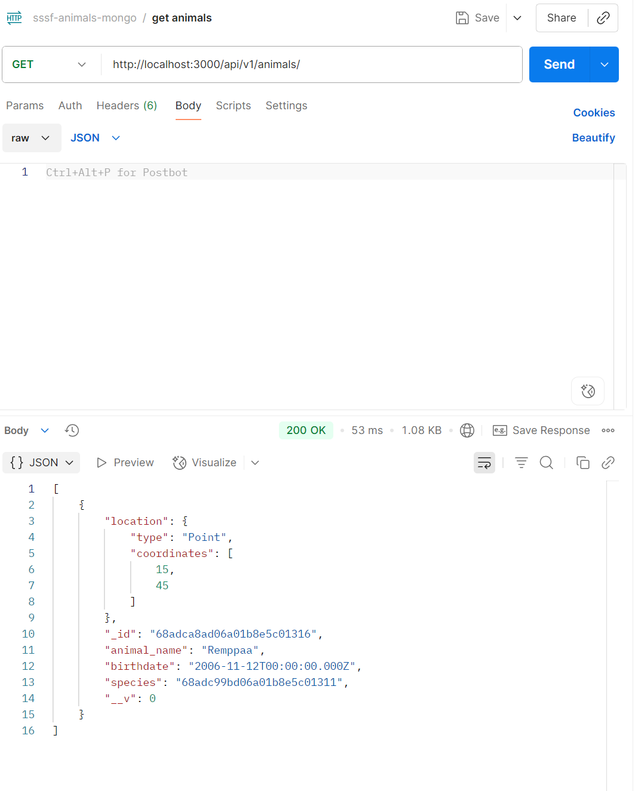
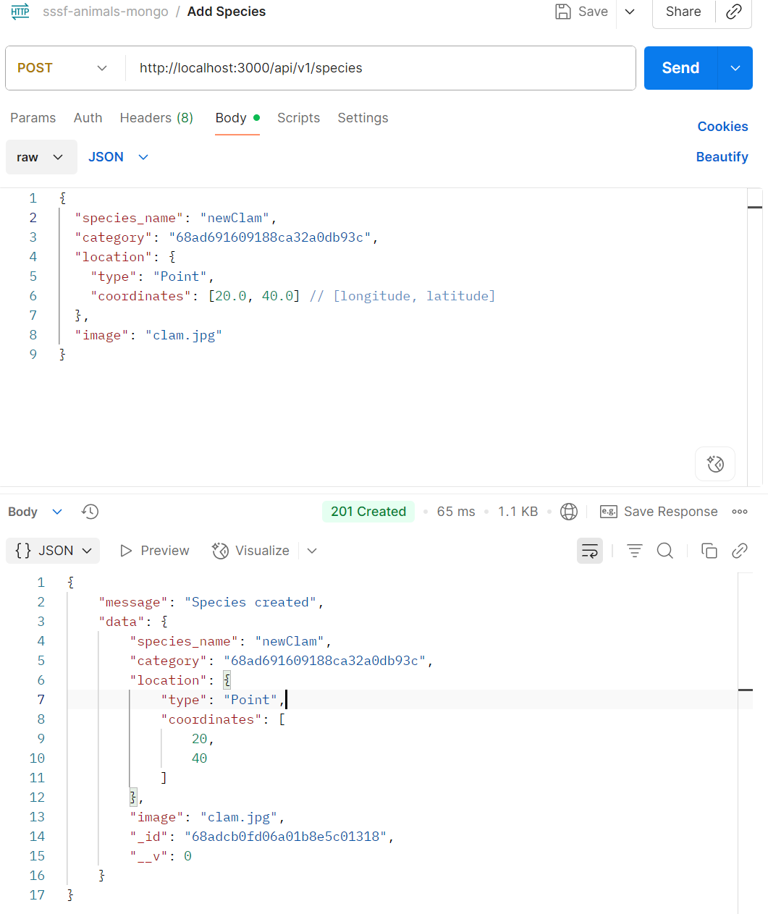
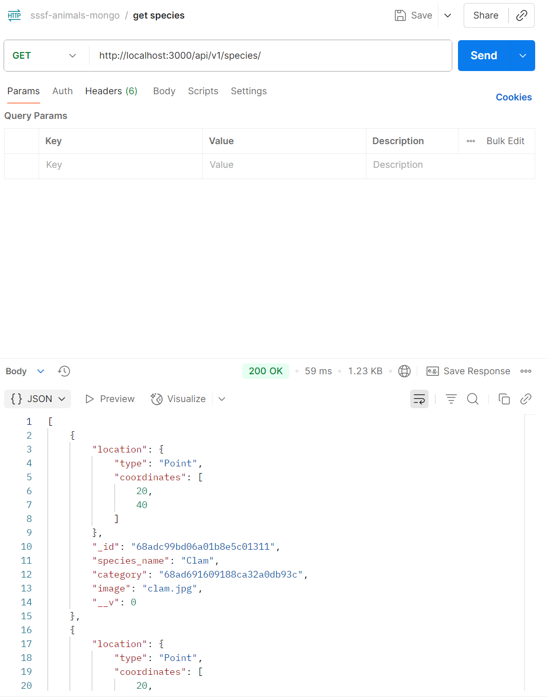
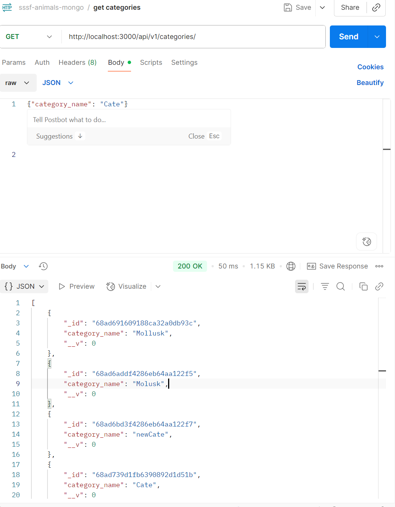
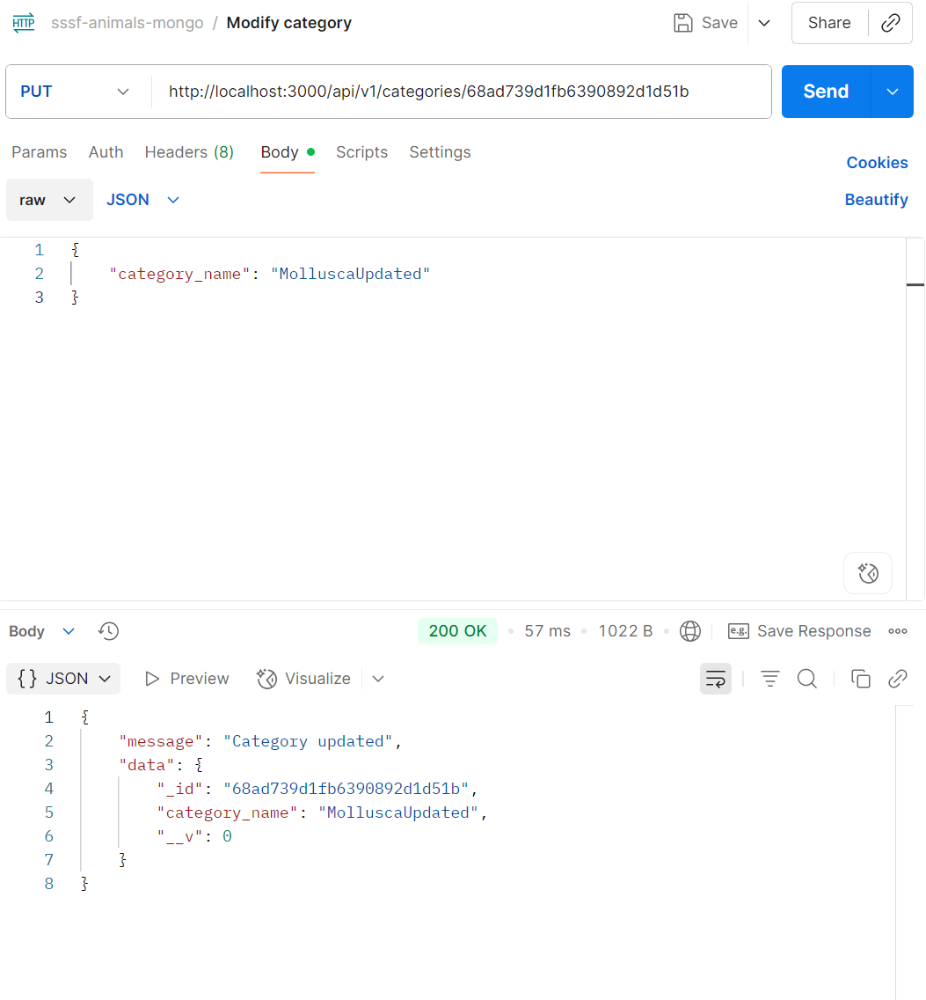
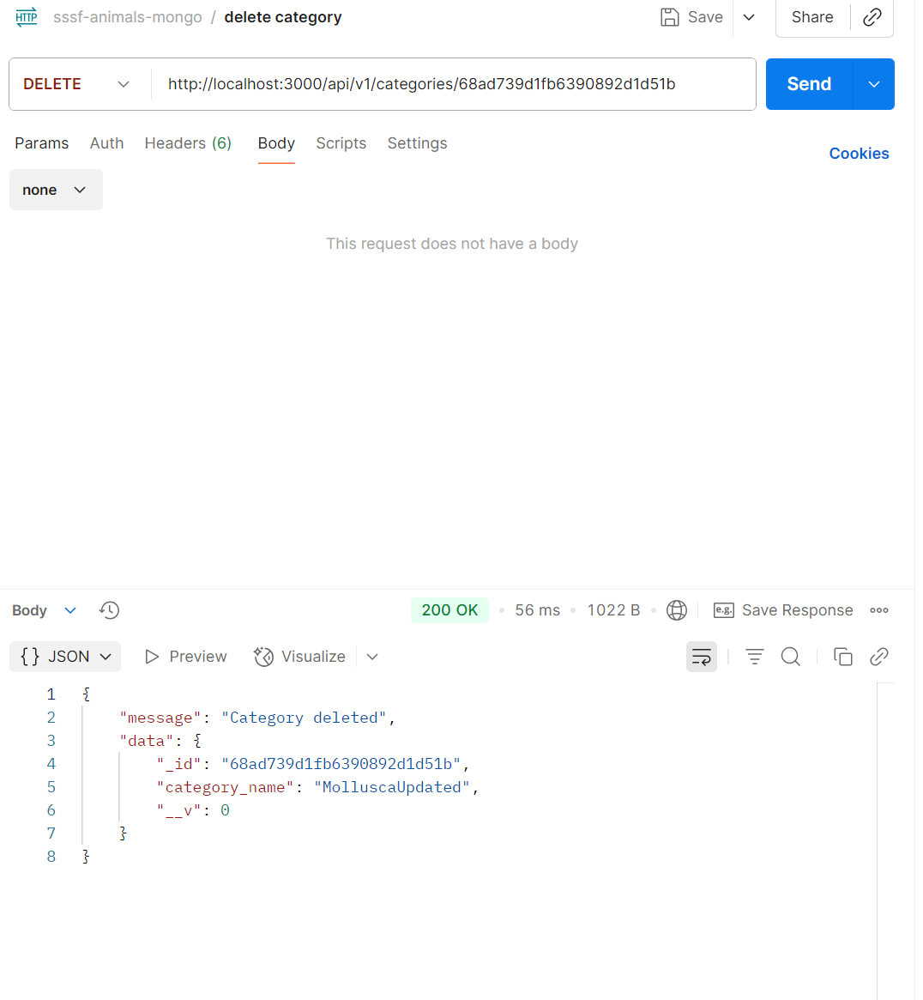
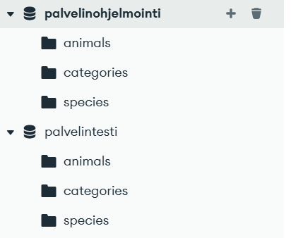
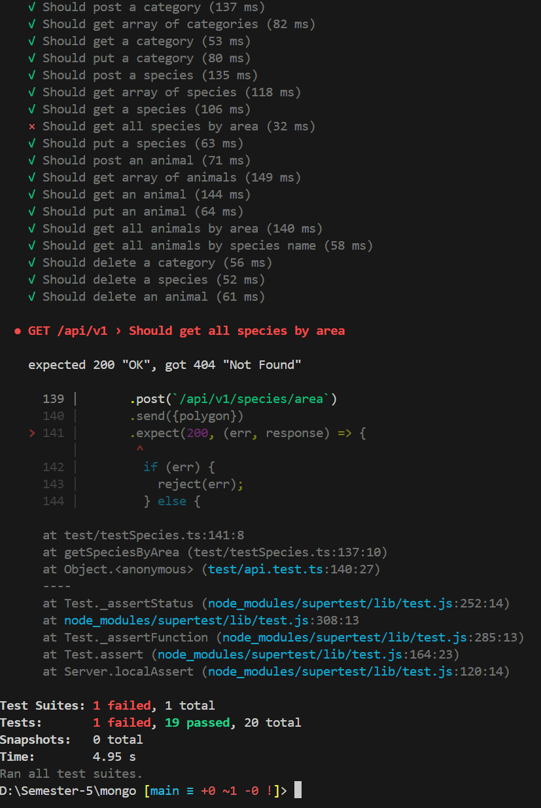

# Rest API with typescript + mongo - starter files

# TEST by Postman
## POST add animals
```bash
http://localhost:3000/api/v1/animals
```



## GET animals
```bash
http://localhost:3000/api/v1/animals
```


## POST add species
```bash
http://localhost:3000/api/v1/species
```


## GET species
```bash
http://localhost:3000/api/v1/species/
```


## GET categories
```bash
http://localhost:3000/api/v1/categories/

```


## PUT modify category
```bash
http://localhost:3000/api/v1/categories/68ad739d1fb6390892d1d51b
```


## Delete category
```bash
http://localhost:3000/api/v1/categories/68ad739d1fb6390892d1d51b
```


## MongoDB
```bash
MongoDB
```



## NPM RUN TEST
```bash
TEST
```



